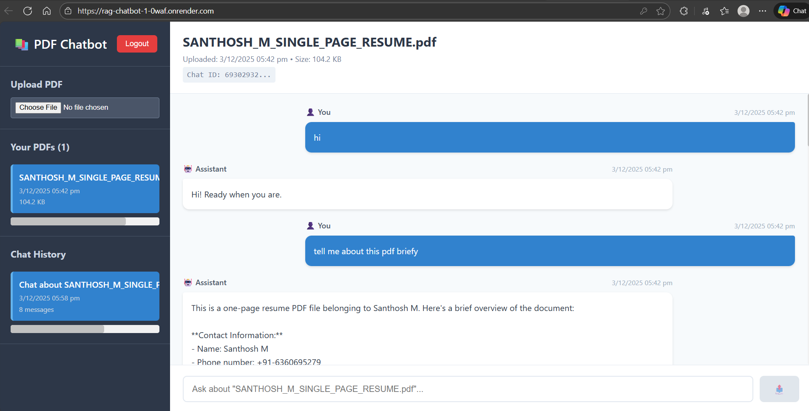
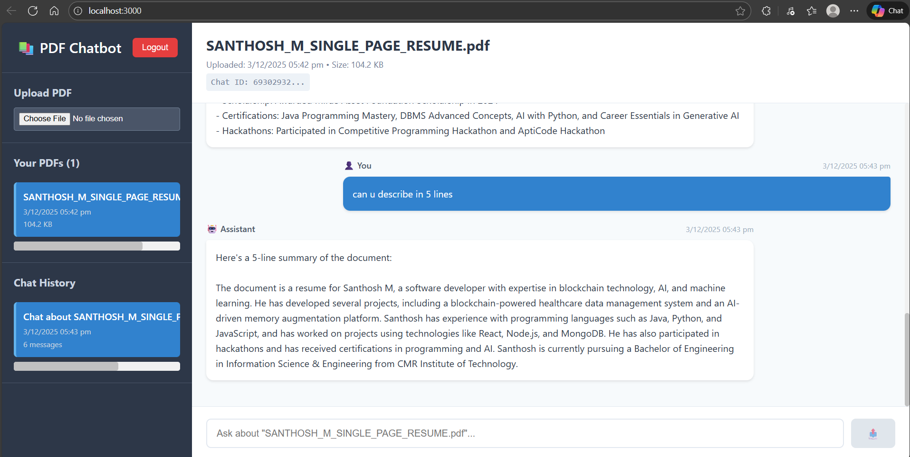

# RAG PDF Chatbot 🤖

An AI-powered web app that lets you upload PDF files and chat with them using smart search (RAG) and AI responses.

---

## 🚀 Features

- Upload PDF files
- Ask questions from PDFs
- Smart AI-based answers
- Chat history per document
- Cloud storage for PDFs
- User login system
- Fast response using AI models

---

## 🛠 Tech Stack

- Frontend: React (Vite)
- Backend: Node.js + Express
- Database: MongoDB
- Storage: Cloudinary
- AI Model: Groq / LLaMA
- Vector Search: Embeddings
- Hosting: Render

---

## 📸 Screenshots

### ✅ Deployed Application


### ✅ PDF Upload Screen


### ✅ Chat Interface


---

## ⚙️ How to Run Locally

```bash
git clone https://github.com/Santhosh-m2004/rag-chatbot
cd rag-chatbot
```

### Backend
```bash
cd backend
npm install
npm start
```

### Frontend
```bash
cd frontend
npm install
npm run dev
```

---

## 🌐 Live Demo


```
Frontend: https://rag-chatbot-1-0waf.onrender.com
Backend:  https://rag-chatbot-lsru.onrender.com/
```

---

## 👤 Author

**Santhosh M**

---

⭐ If you like this project, give it a star!
